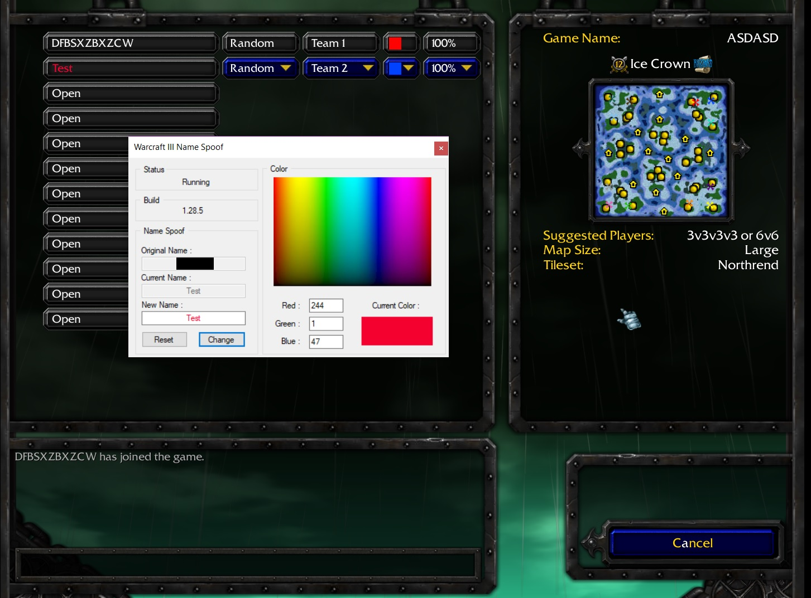

# Warcraft3 Name Spoof

This repository holds a C# application that provides memory editing in Warcraft 3 game connected to battlenet.

## Features
- Supports multiple game versions
- Reads game build
- Reads username from memory
- Custom username
- Custom color

## Usage
Run Warcraft 3 game and login to battlenet. Enter chat room and run Warcraft 3 Name Spoof. 
(Username won't be changed in room chat. You can see modification after entering game lobby)

## Copyright and License

Copyright 2013 Vacko

Licensed under the [MIT licence](LICENSE)

## Pictures

